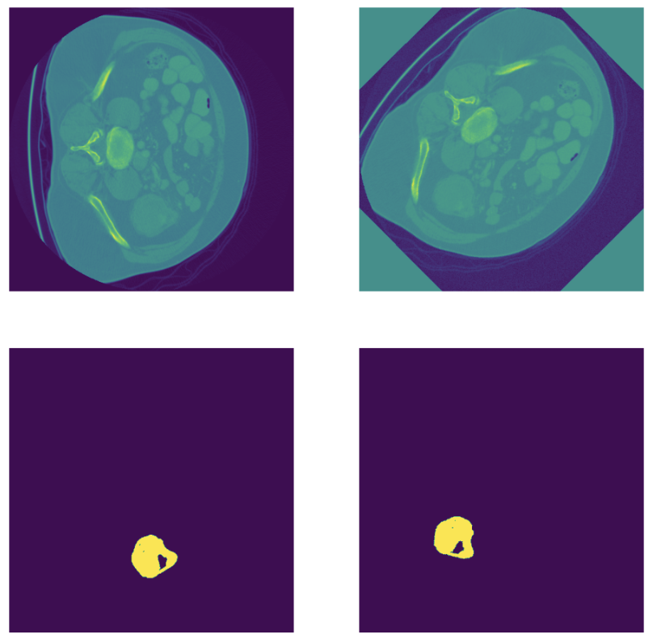

# Project 1: Medical Image Segmentation

Apply image segmentation to CT scans to identify colon cancer tissue

- Project report: `ML4HC_Project_1_Report.pdf` and presentation slides `ML4HC_Project_1_Slides.pdf`
- Conda environment: `mlh4hc_project1_env.yml`
- Respective notebooks for pretraining and training (actual data not publicly available, pretraining data on linked Kaggle page)
- U-Net architecture implementation from `https://github.com/karolzak/keras-unet`

Sample image to which segmentation has been applied:

